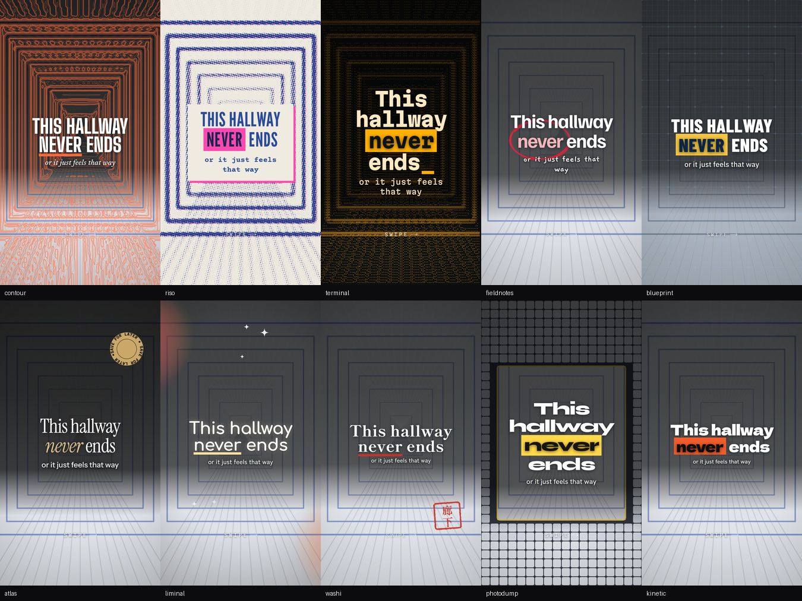
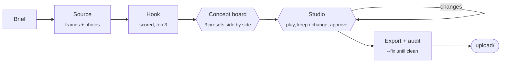
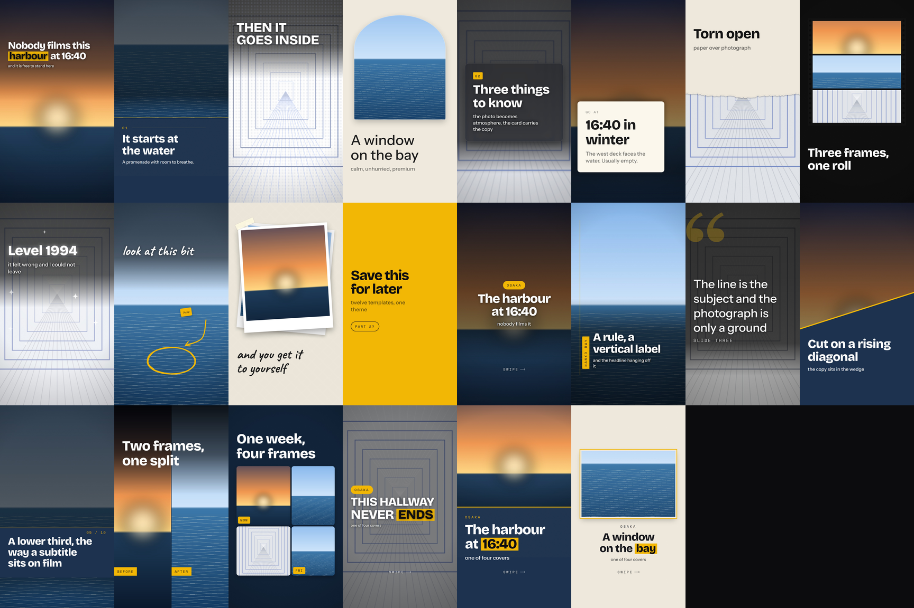

<div align="center">

# tiktok-photo-carousel

**Turn your own photos and video clips into finished TikTok photo-mode carousels.**<br>
Styled, reviewed, approved, exported and checked for readability - by an agent skill, in your browser.

[](https://skills.sh/RobTar97/tiktok-photo-carousel)
[](https://github.com/RobTar97/tiktok-photo-carousel/actions/workflows/test.yml)
[](LICENSE)


[Get started](docs/getting-started.md) · [How it works](docs/how-it-works.md) · [Presets](skills/tiktok-photo-carousel/references/presets.md) · [Templates](skills/tiktok-photo-carousel/references/templates.md) · [All docs](docs/README.md)



<sub>Ten ready-made presets, one demo photo. <code>contour</code> traces the photo's own light as a topographic map, <code>riso</code> re-screens it as two-ink halftone, <code>terminal</code> rebuilds it in ASCII, <code>photodump</code> tiles it round a sharp window.</sub>

</div>

---

## Why this exists

Carousel tools either paste text on a photo or generate the images for you. This does neither. **Every image is something you shot, a frame pulled from your video, or a drawing made by code *from* your photo** - its light traced as contour lines, re-printed as halftone, rebuilt in characters. No AI image generation, no stock, nothing invented.

And it checks its own work. The safe zones come from TikTok's published specs and were verified on a real phone. A readability audit measures the contrast of every line against the pixels actually behind it, and fixes what it can.

## What you get

<table>
<tr>
<td width="33%" valign="top">

### Imagery from your material

- **Frames from video** - sharpest, best-exposed, distinct; phone HDR tone-mapped
- **Photos redrawn in code** - contour, halftone, ASCII, dither, mosaic
- **21 drawing generators** - pen marks that aim at your words, seals, badges, grids, light leaks

</td>
<td width="33%" valign="top">

### Ready styles

- **10 presets** - one word sets fonts, palette, texture and art
- **22 templates** - including **4 covers** built for the profile grid's crop
- **Brand kits** layer your fonts and colours over any preset

</td>
<td width="33%" valign="top">

### Built for TikTok

- **Safe zones** measured on an iPhone 16e
- **Copy linting** against the 3-5 s auto-advance
- **Readability audit** of the shipped pixels, with `--fix`
- **`upload/`** - files numbered in posting order

</td>
</tr>
</table>

## Quick start

```bash
npx skills add RobTar97/tiktok-photo-carousel
```

Then, from the installed skill folder:

```bash
npm install && npx playwright install chromium   # rendering
pip install -r requirements.txt                  # photo analysis
node scripts/selftest.js                         # prints: OK
```

Ask your agent:

> Make a TikTok carousel from `./osaka-trip` - photos and a few clips. Travel guide, goal is saves.

Full walkthrough: **[Getting started](docs/getting-started.md)**.

## How a carousel gets made



Two gates where **you** decide: the concept board (which look) and the studio (every slide, Keep or Change, then Approve). Nothing is final until you approve it. → [The workflow](docs/workflow.md)

## Templates



<sub>All 22 on the repo's generated demo photos. → <a href="skills/tiktok-photo-carousel/references/templates.md">Template catalogue</a></sub>

## Documentation

| | |
|---|---|
| **Start here** | [Getting started](docs/getting-started.md) · [The workflow](docs/workflow.md) · [FAQ](docs/faq.md) |
| **Style** | [Presets](skills/tiktok-photo-carousel/references/presets.md) · [Templates](skills/tiktok-photo-carousel/references/templates.md) · [Code-drawn art](skills/tiktok-photo-carousel/references/art.md) · [Design system](skills/tiktok-photo-carousel/references/design-system.md) · [Brand kits](skills/tiktok-photo-carousel/references/brand-kit.md) |
| **Copy** | [Hooks](skills/tiktok-photo-carousel/references/hooks.md) · [Captions](skills/tiktok-photo-carousel/references/captions.md) · [Niches](skills/tiktok-photo-carousel/references/niches.md) |
| **Under the hood** | [How it works](docs/how-it-works.md) · [deck.json](skills/tiktok-photo-carousel/references/deck-format.md) · [Safe zones](skills/tiktok-photo-carousel/references/safe-zones.md) · [Video](skills/tiktok-photo-carousel/references/video.md) · [Quality and testing](docs/quality.md) |
| **Help** | [Troubleshooting](docs/troubleshooting.md) · [Roadmap](docs/roadmap.md) · [Changelog](CHANGELOG.md) |
| **Project** | [Contributing](CONTRIBUTING.md) · [Code of conduct](CODE_OF_CONDUCT.md) · [Security](SECURITY.md) · [Examples](examples/README.md) |

The complete, categorised index is **[docs/README.md](docs/README.md)**.

## Repository layout

```text
skills/tiktok-photo-carousel/   the skill - this folder is what gets installed
  SKILL.md                      the workflow the agent follows
  html/                         engine: templates, rendering, code-drawn art, studio
  presets/                      the ten looks (JSON - add your own)
  scripts/                      frames, analyze, build, apply-edits, export, audit, selftest
  references/                   reference docs the agent reads on demand
docs/                           guides for people
examples/                       demo photos, decks, renders, and the script that makes them
.github/                        CI, issue and pull request templates
```

## Contributing

Presets, templates, generators and niche playbooks are all welcome. Every one is a small, self-contained addition, and the self-test renders and audits it for you. Start with **[CONTRIBUTING.md](CONTRIBUTING.md)**.

## License

[MIT](LICENSE). Bundled fonts for the legacy renderer are under the SIL Open Font License 1.1 (`skills/tiktok-photo-carousel/fonts/OFL-*.txt`). All demo images are generated by code, so nothing in `examples/` is copyrighted.
