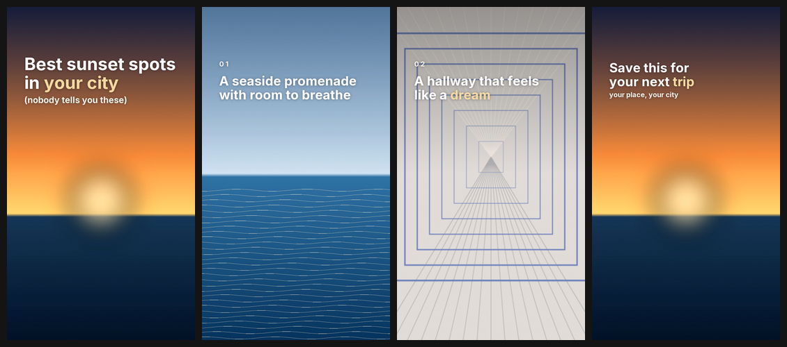

# tiktok-photo-carousel

[](https://skills.sh/RobTar97/tiktok-photo-carousel)
[](https://github.com/RobTar97/tiktok-photo-carousel/actions/workflows/test.yml)
[](LICENSE)

An agent skill that turns a folder of your own photos into a **TikTok photo-mode carousel**: it picks and orders the photos, writes the hook, slide text and caption, and burns the text onto the images inside TikTok's safe zones. No video, no AI image generation, no API keys, no network.


## Install

```bash
npx skills add RobTar97/tiktok-photo-carousel
```

The [skills CLI](https://github.com/vercel-labs/skills) installs it into the agents you choose (Claude Code, Cursor, Codex, and others). Useful flags:

```bash
npx skills add RobTar97/tiktok-photo-carousel --list          # see what is inside
npx skills add RobTar97/tiktok-photo-carousel -a claude-code  # one specific agent
npx skills add RobTar97/tiktok-photo-carousel -g              # global instead of per-project
```

Then install the one dependency, [Pillow](https://pypi.org/project/pillow/) (Python 3.9+), and run the self-test from the installed skill folder:

```bash
pip install -r requirements.txt
python3 scripts/selftest.py        # prints: OK - 8 styles rendered
```

<details>
<summary>Manual install without the CLI</summary>

Copy `skills/tiktok-photo-carousel/` into your agent's skills folder (for Claude Code: `~/.claude/skills/` or `.claude/skills/` in a project).
</details>

## Use it

Just ask your agent, pointing it at a folder of photos:

> Make a TikTok carousel from the photos in `./trip-photos`. Travel-guide style, about Kyoto, goal is saves.

> Add dreamcore text to these 7 photos. Hook: "Accidentally found Level 1994 in Osaka". Write the caption too.

The skill asks what the carousel is for (niche, goal, language, slide count), chooses photos, writes the copy, renders numbered slides plus a contact sheet, checks the result, and fixes problems it finds. Output:

```text
out/
  01.png ... 08.png     1080x1920 slides
  _contact_sheet.png    all slides at a glance
  caption.md            caption + hashtags
```

You can also run the renderer yourself:

```bash
python3 scripts/carousel.py --photos ./photos --script ./script.json --out ./out --style editorial
```

```json
[
  {"photo": "sunset.jpg", "text": "Best sunset spots // in *your city*", "sub": "(nobody tells you these)", "pos": "top", "size": 104},
  {"photo": "sea.jpg", "kicker": "01", "text": "A seaside promenade // with room to breathe", "pos": "top"}
]
```

That script renders like this (`editorial` style):



The slides are in [`examples/output/`](examples/output). All demo images are generated by `examples/make_demo_photos.py`, so nothing is copyrighted. Regenerate them with `python3 examples/make_demo_photos.py`.

## What you get

- **Safe zones built in** - text avoids the status bar, the caption/button area and the right-hand icons; `--debug` shows the zones in red. [Details](skills/tiktok-photo-carousel/references/safe-zones.md)
- **8 style presets** - `dreamcore`, `dreamcore-quiet`, `editorial`, `clean-bold`, `impact-meme`, `handwritten`, `vhs-mono`, `serif-soft`. [Styles and filters](skills/tiktok-photo-carousel/references/styles-and-filters.md)
- **7 simple filters** - dreamcore, bloom, golden, warm, vhs, contrast, black and white.
- **Auto-fit text** - word wrap, auto-shrink, highlight words (`*word*`), forced breaks (` // `), kicker numbers, sub lines, retro date stamp.
- **Niche playbooks** - dreamcore, travel guide, romantic, POV story, tips list, retro. [Niches](skills/tiktok-photo-carousel/references/niches.md)
- **Caption writing** - hook, context, one call to action, 3-5 hashtags. [Guide](skills/tiktok-photo-carousel/references/captions.md)
- **Japanese / Chinese / Korean text** - uses a system CJK font automatically (or `--cjk-font`).
- **Cross-platform** - Windows, macOS, Linux; fonts are bundled.
- **Instagram too** - `--preset instagram` gives a 1080x1350 canvas with Instagram margins.

## How it works

The skill is split so an agent loads only what it needs:

```text
skills/tiktok-photo-carousel/
  SKILL.md                 workflow + commands (the only file always read)
  requirements.txt         Pillow
  scripts/
    carousel.py            the renderer (Pillow only)
    styles.json            style presets - edit or add your own
    selftest.py            smoke test
  references/              read on demand
    script-format.md  niches.md  captions.md  safe-zones.md  styles-and-filters.md
  fonts/                   Inter, Fredoka, Lora, Anton, Caveat, Space Mono (+ OFL licences)
```

The image work is deterministic: crop, tints, blur-and-screen glow, grain, and font rendering. The same inputs always give the same pixels. The agent supplies the judgment around it: choosing and ordering photos, writing copy, placing text away from the subject, and reviewing the result.

## Limits

- It does not edit photo content: no object removal, cut-outs, background extension or restyling.
- Filters are intentionally simple.
- Emoji do not render (a Pillow limitation).
- CJK fonts are not bundled; install one or pass `--cjk-font`.

## Troubleshooting

| Problem | Fix |
|---|---|
| `Pillow is required` | `pip install -r requirements.txt` |
| Text shows as empty boxes (Japanese etc.) | pass `--cjk-font /path/to/font` |
| `WARNING: text may not fit` | shorten the text or add ` // ` breaks |
| Text hard to read on a bright photo | try another style/filter, shorter text, or `editorial` (adds a gradient) |
| `python3: command not found` on Windows | use `python` |
| Colors look different on the phone | TikTok recompresses; keep text white with shadow/outline and avoid thin fonts |

## Privacy and security

Runs entirely locally. The script makes no network requests, spawns no subprocesses, reads only the files you point it at and writes only to `--out`. Original photos are never modified.

## Contributing

Issues and pull requests are welcome, especially new styles, filters and niche playbooks. Run `python3 skills/tiktok-photo-carousel/scripts/selftest.py` before opening a PR. If you add a font, include its licence file and list it in `references/styles-and-filters.md`.

## License

MIT for the code and docs ([LICENSE](LICENSE)). Bundled fonts are under the SIL Open Font License 1.1; see `skills/tiktok-photo-carousel/fonts/OFL-*.txt`.
