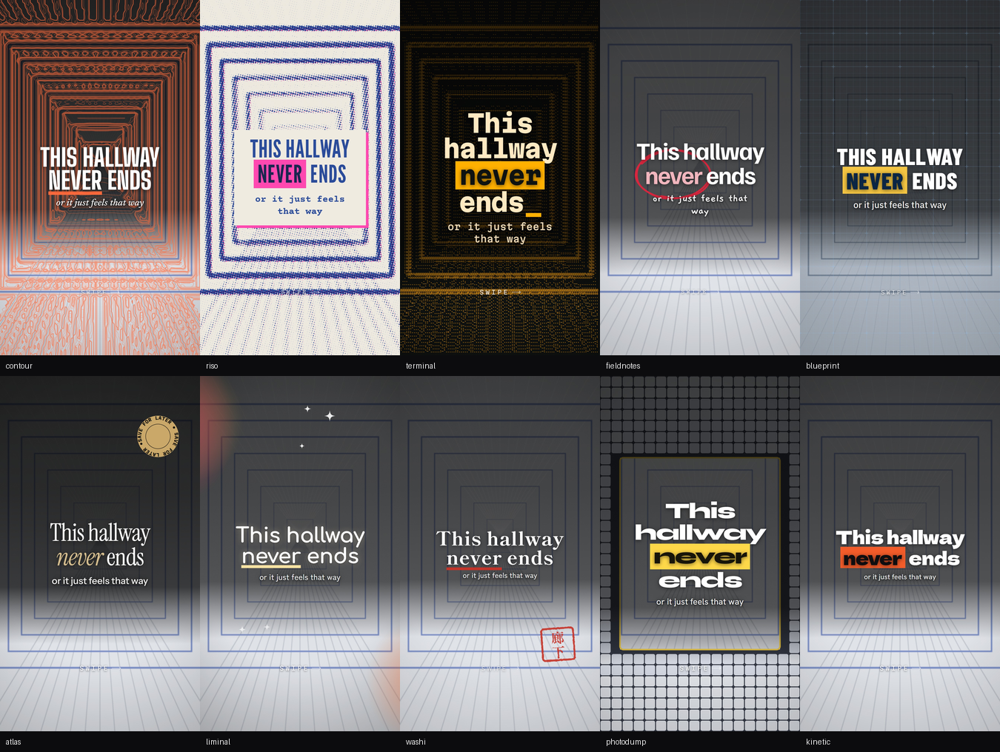

# tiktok-photo-carousel

[](https://skills.sh/RobTar97/tiktok-photo-carousel)
[](https://github.com/RobTar97/tiktok-photo-carousel/actions/workflows/test.yml)
[](LICENSE)

An agent skill that turns **your own photos and video clips** into a finished TikTok photo-mode carousel: styled, reviewed, approved, exported, and checked for readability.

**No AI image generation.** Every image is something you shot, a frame pulled from your video, or a drawing made by code *from* your photos - the photo's own light traced as contour lines, re-printed as halftone, rebuilt in ASCII.



*Ten ready-made presets, one demo photo. Contour traces the photo's light as a topographic map; riso re-screens it as two-ink halftone; terminal rebuilds it in ASCII; photodump tiles it round a sharp window.*

## Install

```bash
npx skills add RobTar97/tiktok-photo-carousel
```

The [skills CLI](https://github.com/vercel-labs/skills) installs it into the agents you choose (Claude Code, Cursor, Codex, and others). Then, from the installed skill folder:

```bash
npm install && npx playwright install chromium   # rendering
pip install -r requirements.txt                  # photo analysis
node scripts/selftest.js                         # prints: OK
```

For video, install [ffmpeg](https://ffmpeg.org) (`winget install Gyan.FFmpeg`, `brew install ffmpeg`, `apt install ffmpeg`).

<details>
<summary>Manual install without the CLI</summary>

Copy `skills/tiktok-photo-carousel/` into your agent's skills folder (for Claude Code: `~/.claude/skills/` or `.claude/skills/` in a project).
</details>

## Use it

> Make a TikTok carousel from `./osaka-trip` - photos and a few clips. Travel guide, goal is saves.

> Turn these 7 photos into a dreamcore carousel. Write the hooks.

The agent works in gates, so you steer before anything is final:

1. **Brief** - niche, goal, language, slide count, in one question.
2. **Source** - pulls the sharpest frames from your clips, analyses every photo, picks and orders them.
3. **Hook** - writes 8-10 candidates across different mechanisms, scores them, and offers you the best three.
4. **Concept board** - the same opening slides in three presets, side by side. You pick a look, or mix two.
5. **Studio** - the full deck in your browser, reloading itself as the agent edits (`--watch`). Press **P** to watch it as a viewer would, mark each slide **Keep** or **Change** with a note, edit any text in place, then **Approve deck**.
6. **Export and audit** - slides, an `upload/` folder, and a contrast audit that fixes its own scrims.

```text
out/
  upload/01.jpg ...      what you post, in order - 01 is the cover
  01.png ...             1080x1920 masters
  cover.png              the cover, built to survive the 1:1 profile-grid crop
  _cover_grid.png        what the profile grid will show
  _contact_sheet.png     every slide, labelled
  _report.json           safe zones, measurements
```

## The pipeline

```bash
python3 scripts/frames.py   --videos ./clips --out ./photos              # best stills, HDR tone-mapped
python3 scripts/analyze.py  --photos ./photos --out work/analysis.json --resize work/photos
node    scripts/build.js    --deck work/deck.json --out work/carousel.html   # lints the copy
#       open carousel.html: review, approve -> edits.json
node    scripts/apply-edits.js --deck work/deck.json --edits edits.json
node    scripts/export.js   --html work/carousel.html --out ./out
python3 scripts/audit.py    --out ./out --fix work/deck.json             # repeat until clean
```

`deck.json` is the only state. A preset makes it short:

```jsonc
{
  "photos": "./photos",
  "theme": { "preset": "contour" },
  "slides": [
    { "template": "cover", "photo": "a.jpg",
      "text": "This isn't a *render*", "sub": "it's a real building, and you can walk in" },
    { "template": "editorial-split", "photo": "b.jpg", "kicker": "look up",
      "text": "Seven floors in primary colours", "sub": "stacked to the roof" }
  ]
}
```

## What you get

**Imagery from your own material**
- **Frames from video** - samples each clip, scores frames for sharpness and exposure, drops near-duplicates, spreads the picks, tone-maps phone HDR so frames are not washed-out grey. [Video](skills/tiktok-photo-carousel/references/video.md)
- **Photos redrawn in code** - `contour`, `halftone`, `ascii`, `dither`, `mosaic`, all computed from the photo's own luminance and colour, aligned to its crop.
- **Code-drawn art** - 21 seeded generators: pen marks that **aim at the words** (circle the highlighted word, underline the hook, an arrow to the subject), hanko seals, rotating badges, blueprint grids, dimension lines, routes, tape, paper fibres, light leaks that keep off the copy. [Art](skills/tiktok-photo-carousel/references/art.md)

**Ready styles**
- **10 presets** - `liminal`, `contour`, `riso`, `fieldnotes`, `blueprint`, `washi`, `terminal`, `photodump`, `kinetic`, `atlas`. Fonts, palette, texture and art in one word, each with a single signature element. [Presets](skills/tiktok-photo-carousel/references/presets.md)
- **22 templates, four of them covers** - `cover`, `cover-word` (a poster stack, each line set to full width), `cover-split` (half photo, half block), `cover-frame` (a framed print). All four keep the title inside the square the profile grid keeps; rotate them so a grid of posts is not one layout in ten fonts. The rest: full-bleed hook, editorial split, index card, caption bar, quote pull, diagonal split, bento, compare, film strip, notes card, arch window, polaroid stack, frosted card, torn reveal, duotone poster, sticker chaos, dreamcore glow, end card. [Templates](skills/tiktok-photo-carousel/references/templates.md)
- **Brand kits** layer over a preset: your fonts and colours, the preset's art. [Brand kits](skills/tiktok-photo-carousel/references/brand-kit.md)

**Built for TikTok**
- **Safe zones from the published specs** - ~150px top, ~250-270px bottom, the icon column. One set of fractions drives both the layout and the check. [Safe zones](skills/tiktok-photo-carousel/references/safe-zones.md)
- **A cover that survives the grid** - the first image is the cover, and the profile grid crops it to 1:1. The `cover` template keeps the title in the square that survives.
- **Copy linting** - the build flags hooks over 9 words, slides over ~14 words (photo mode moves on after 3-5 seconds), more than one highlight or CTA, filler, and unverifiable claims - and lints `caption.md` the same way: first-line length, 3-5 hashtags, one call to action.
- **Hooks with a method** - eight mechanisms, a scoring rubric, bad-to-better rewrites, Japanese patterns. [Hooks](skills/tiktok-photo-carousel/references/hooks.md)

**Checked, not eyeballed**
- **A readability audit of the shipped pixels** - real WCAG contrast for every line against what is actually behind it, measured on background plates rendered with the glyphs made transparent. 48px / 32px size floors. `--fix` raises the scrim where needed and knows when the scrim is not the problem. [Review loop](skills/tiktok-photo-carousel/references/review-loop.md)
- **A self-test of everything** - every template, preset and generator rendered and audited, the studio driven like a reviewer, edits merged, frames pulled from a clip.


## Layout

```text
skills/tiktok-photo-carousel/
  SKILL.md                 the workflow (the only file always loaded)
  html/
    templates.css          22 templates, the layer system, legibility rules
    engine.js              rendering, autofit, presets, verifier, studio, play mode
    art.js                 the code-drawn imagery
    shell.html             the studio page
  presets/                 10 ready-made looks (JSON - add your own)
  scripts/
    frames.py              clips -> best stills
    analyze.py             photos -> palette, focus, contrast, grids; upright copies
    build.js               deck.json -> carousel.html; lints the copy
    apply-edits.js         the studio's edits.json -> deck.json
    export.js              slides, upload/, cover, contact sheet, safe-zone report
    audit.py               contrast + size audit of the pixels; --fix
    selftest.js            renders and checks everything
    carousel.py            legacy Pillow renderer (offline, text over photo)
  references/              read on demand
    hooks  presets  art  templates  deck-format  review-loop  design-system
    safe-zones  video  captions  niches  brand-kit  (+ legacy: script-format, styles-and-filters)
  brand/                   brand kits
```

## The legacy engine

v1's Pillow renderer is still here, unchanged, and needs no Node and no network:

```bash
python3 scripts/carousel.py --photos ./photos --script ./script.json --out ./out --style editorial
```

[Styles and filters](skills/tiktok-photo-carousel/references/styles-and-filters.md) · [script format](skills/tiktok-photo-carousel/references/script-format.md)

All demo images in `examples/` are generated by `examples/make_demo_photos.py`, so nothing is copyrighted.

## Limits

- It does not remove objects, cut out subjects, extend backgrounds or invent scenery - that needs generative imagery, which this skill does not use.
- Fonts load from Google Fonts, so the first build of a new look needs a connection. Set `theme.fontSource: "local"` to supply your own.
- The verifier and audit check geometry and contrast. They cannot tell whether copy sits on someone's face - the contact sheet is for that.

## Troubleshooting

| Problem | Fix |
|---|---|
| `Playwright is missing` | `npm install && npx playwright install chromium` |
| `Pillow is required` | `pip install -r requirements.txt` |
| `ffmpeg not found` | install ffmpeg (see Install) - only needed for video |
| Video frames look grey and flat | the clip is HDR; `frames.py` tone-maps it - make sure you used it rather than a manual grab |
| A photo appears sideways | it carries EXIF rotation; re-run `analyze.py --resize`, which writes upright copies |
| `photo not found` from `build.js` | the name in `deck.json` must match the file in the photos folder |
| A build error about word count | the slide carries two ideas - split it |
| audit: "raising the scrim did not help" | something drawn above the scrim sits behind the copy - find it with `X` in the studio |
| Fonts fall back to system faces | the Google Fonts request was blocked; check the network or use `fontSource: "local"` |
| `python3: command not found` on Windows | use `python` |

## Privacy

Everything runs locally. Scripts read only the files you point them at and write only to the output folders you name; originals are never modified. The one network request is the Google Fonts stylesheet in the built page.

## Contributing

Issues and pull requests welcome - especially presets, generators, templates and niche playbooks. Run `node skills/tiktok-photo-carousel/scripts/selftest.js` before opening a PR; it renders and audits everything. Adding a preset or a template: see the end of [presets.md](skills/tiktok-photo-carousel/references/presets.md) and [templates.md](skills/tiktok-photo-carousel/references/templates.md).

## License

MIT for the code and docs ([LICENSE](LICENSE)). Bundled fonts are under the SIL Open Font License 1.1; see `skills/tiktok-photo-carousel/fonts/OFL-*.txt`.
