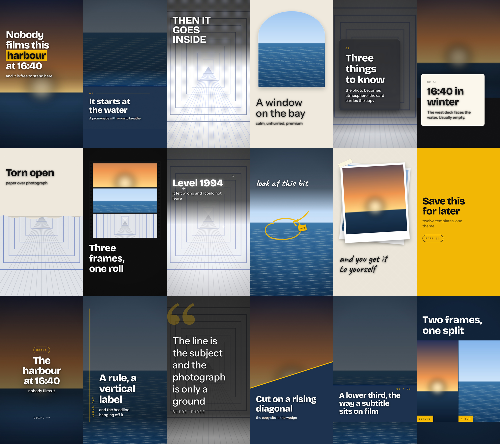

# tiktok-photo-carousel

[](https://skills.sh/RobTar97/tiktok-photo-carousel)
[](https://github.com/RobTar97/tiktok-photo-carousel/actions/workflows/test.yml)
[](LICENSE)

An agent skill that turns a folder of your own photos into a **TikTok photo-mode carousel**. It picks and orders the photos, writes the hook, slide text and caption, lays each slide out in HTML from eighteen composition templates, lets you review and edit the whole deck in your browser, then exports pixel-exact 1080x1920 slides, checks that nothing landed under TikTok's interface, and audits the shipped pixels for real contrast and legible type.

No video, no AI image generation, no API keys.



## Install

```bash
npx skills add RobTar97/tiktok-photo-carousel
```

The [skills CLI](https://github.com/vercel-labs/skills) installs it into the agents you choose (Claude Code, Cursor, Codex, and others). Then, from the installed skill folder:

```bash
npm install && npx playwright install chromium   # HTML engine
pip install -r requirements.txt                  # photo analysis
node scripts/selftest.js                         # prints: OK
```

<details>
<summary>Manual install without the CLI</summary>

Copy `skills/tiktok-photo-carousel/` into your agent's skills folder (for Claude Code: `~/.claude/skills/` or `.claude/skills/` in a project).
</details>

## Use it

Point your agent at a folder of photos:

> Make a TikTok carousel from the photos in `./trip-photos`. Travel-guide style, about Kyoto, goal is saves.

> Build a carousel from these 7 photos. Hook: "Accidentally found Level 1994 in Osaka". Write the caption too.

The agent asks what the carousel is for, analyses and views the photos, writes the copy, shows you **three design directions** as a single slide each, builds the full deck, hands you a browser studio to review and edit it, then exports.

```text
out/
  01.png ... 08.png     1080x1920 slides
  cover.png             the thumbnail, built to survive the 1:1 grid crop
  _cover_grid.png       what the profile grid will actually show
  _contact_sheet.png    every slide, labelled
  _report.json          safe-zone verification + measurements
  caption.md            caption + hashtags
```

## The pipeline

```bash
# 1. palette, crop focus, per-band contrast - and web-sized copies
python3 scripts/analyze.py --photos ./photos \
        --out work/analysis.json --resize work/photos

# 2. deck.json -> one self-contained carousel.html
node scripts/build.js --deck work/deck.json --out work/carousel.html

# 3. open carousel.html, review, edit, Ctrl+S -> edits.json

# 4. slides + cover + contact sheet + verification report
node scripts/export.js --html work/carousel.html --out ./out

# 5. is it actually readable? real contrast against the shipped pixels
python3 scripts/audit.py --out ./out
```

`deck.json` is the only state. Copy and layout live in separate fields, so a round of text edits can never break the geometry.

```jsonc
{
  "photos": "./photos",
  "theme": { "display": "Bricolage Grotesque", "accent": "#f2b705", "highlight": "marker" },
  "slides": [
    { "template": "full-bleed-hook", "photo": "a.jpg",
      "text": "Osaka built a *rainbow* machine in 1994", "sub": "and almost nobody films it" },
    { "template": "editorial-split", "photo": "b.jpg", "kicker": "01",
      "text": "It starts at the water", "sub": "A mosaic plaza, a white bridge, palm trees." }
  ]
}
```

Full schema: [deck-format.md](skills/tiktok-photo-carousel/references/deck-format.md).

## What you get

- **18 composition templates** — cover, full-bleed hook, duotone poster, torn reveal, editorial split, index card, caption bar, quote pull, diagonal split, arch window, frosted card, film strip, notes card, polaroid stack, sticker chaos, dreamcore glow, compare, end card. A template sets the layout; the theme sets type and colour, so a deck still reads as one deck. [Catalogue](skills/tiktok-photo-carousel/references/templates.md)
- **A grid-safe cover** — on a photo post the first image *is* the cover, and the profile grid centre-crops it to 1:1. The `cover` template puts the title inside the square that survives and the swipe cue in the band that does not. You get `cover.png` and a preview of the cropped version.
- **A readability audit** — `audit.py` measures real WCAG contrast for every line against the pixels actually behind it, using background plates rendered with the glyphs made transparent, and enforces TikTok's 48px headline / 32px body floors. [How it reads](skills/tiktok-photo-carousel/references/review-loop.md)
- **Colour from the photographs** — a five-colour palette per photo seeds the theme, so the accent belongs to the images instead of to a default.
- **Measured contrast** — scrim strength comes from the real luminance and busyness of the strip the text sits on, and the gradient ends just past the last line, whatever size the type settled at.
- **A browser review studio** — safe-zone x-ray, a mock of TikTok's actual interface over your slide, and in-place text editing that exports back as `edits.json`. [How the loop works](skills/tiktok-photo-carousel/references/review-loop.md)
- **Safe zones from the published specs** — ~150px top, ~250-270px bottom, the icon column on the lower right. One set of fractions drives both the CSS and the verifier, so the layout and the check cannot disagree. [Details](skills/tiktok-photo-carousel/references/safe-zones.md)
- **Autofit that measures** — binary search against the real rendered box, so type runs as large as it actually can.
- **Japanese as a first-class path** — JP display and text faces, looser leading, manual line breaking, and vertical type. [Design system](skills/tiktok-photo-carousel/references/design-system.md)
- **Brand kits** — a reusable theme plus copy rules, merged under the deck's own choices. [Brand kits](skills/tiktok-photo-carousel/references/brand-kit.md)
- **Niche playbooks and caption rules** — [niches](skills/tiktok-photo-carousel/references/niches.md), [captions](skills/tiktok-photo-carousel/references/captions.md).

## Layout

```text
skills/tiktok-photo-carousel/
  SKILL.md                 workflow + commands (the only file always read)
  html/
    templates.css          the 18 templates and the layer system
    engine.js              rendering, autofit, scrim fitting, verifier, studio
    shell.html             page shell the build fills in
  scripts/
    analyze.py             photos -> palette, focus, contrast, resized copies
    audit.py               exported slides -> contrast, size floors, cover crop
    build.js               deck.json -> carousel.html
    export.js              carousel.html -> slides + contact sheet + report
    selftest.js            renders every template and asserts the output
    carousel.py            legacy Pillow renderer (v1, unchanged)
  references/              read on demand
    templates.md  deck-format.md  design-system.md  review-loop.md
    brand-kit.md  niches.md  captions.md  safe-zones.md
    script-format.md  styles-and-filters.md        (legacy engine)
  brand/                   brand kits
  fonts/                   bundled OFL fonts for the legacy engine
```

## The legacy engine

v1's Pillow renderer is still here and unchanged. It needs no Node and no network:

```bash
python3 scripts/carousel.py --photos ./photos --script ./script.json --out ./out --style editorial
```

Eight text styles, seven filters, safe zones, bundled fonts. Use it when Node is not available or you are re-running an existing v1 script. [Styles and filters](skills/tiktok-photo-carousel/references/styles-and-filters.md) · [script format](skills/tiktok-photo-carousel/references/script-format.md)


All demo images are generated by `examples/make_demo_photos.py`, so nothing is copyrighted.

## Limits

- It does not edit photo content: no object removal, cut-outs, background extension or restyling.
- Fonts load from Google Fonts by default, so the first build of a new theme needs a network connection. Set `theme.fontSource: "local"` to supply your own.
- The verifier checks copy against the safe zones. It does not judge whether text sits on a face — look at the contact sheet.
- The legacy engine does not render emoji (a Pillow limitation). The HTML engine does.

## Troubleshooting

| Problem | Fix |
|---|---|
| `Playwright is missing` | `npm install && npx playwright install chromium` |
| `Pillow is required` | `pip install -r requirements.txt` |
| `photo not found` warning from `build.js` | the name in `deck.json` must match the file in the photos folder exactly |
| Fonts fall back to system faces | the Google Fonts request was blocked; check the network or set `fontSource: "local"` |
| The studio is slow | you skipped `--resize`; re-run `analyze.py` with it |
| `copy hit the minimum size` | the slide carries two ideas — split it |
| audit says a line "drops to 2.1:1" | raise that slide's `scrim`, move the copy with `pos`, or change the photo |
| audit says the cover "leaves the 1:1 grid crop" | slide 1 is not using the `cover` template |
| Colours look different on the phone | TikTok recompresses; avoid thin fonts and very low contrast |
| `python3: command not found` on Windows | use `python` |

## Privacy and security

Everything runs locally. The scripts read only the files you point them at and write only to the output folder you name; original photos are never modified. The one network request is the Google Fonts stylesheet in the built page, which you can turn off with `theme.fontSource: "local"`.

## Contributing

Issues and pull requests welcome, especially new templates and niche playbooks. Run `node skills/tiktok-photo-carousel/scripts/selftest.js` before opening a PR. Adding a template is four steps — see the end of [templates.md](skills/tiktok-photo-carousel/references/templates.md).

## License

MIT for the code and docs ([LICENSE](LICENSE)). Bundled fonts are under the SIL Open Font License 1.1; see `skills/tiktok-photo-carousel/fonts/OFL-*.txt`.
