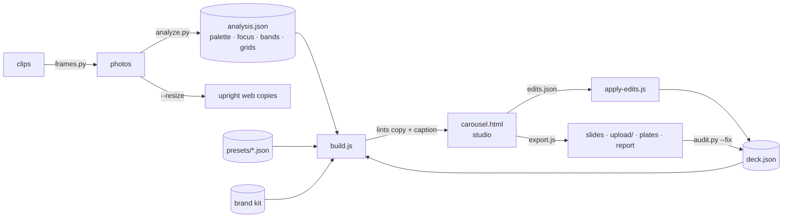
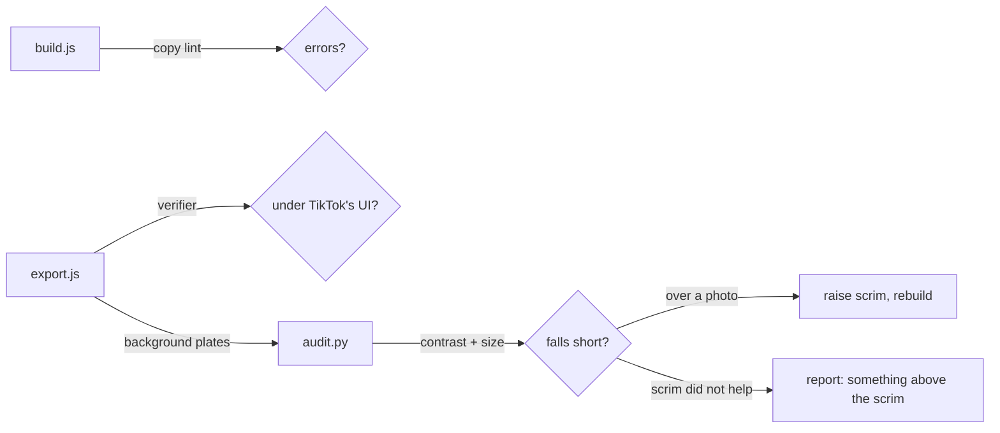

# How it works

The architecture, for anyone changing the engine or curious why it is built
the way it is.

## The pipeline



Every arrow is a script you can run on its own. `deck.json` is the only
state: the studio renders it, the exporter shoots it, edits merge back into
it, and the audit's fixes are written into it.

## Why HTML

The v1 renderer drew text onto photos with Pillow. That can only ever do one
thing - text over a photo. A browser gives you real layout (grid, flex,
masks, clip paths), real typography (variable fonts, kerning, Japanese line
breaking, vertical text), blend modes and SVG - and Playwright turns it into
exact 1080x1920 pixels. The Pillow renderer is still in the repo, unchanged,
for anyone who needs to run fully offline.

## One page, everything inlined

`build.js` produces a single `carousel.html`: the template stylesheet, the
art library, the engine and the deck are all inlined. Only the photos stay
as relative files. It opens straight from disk - no server, no build step -
which is what lets you double-click it and review.

## The slide

Each slide is a fixed 1080x1920 element built from layers:

```text
layer-chrome    mock TikTok interface        studio only
layer-safe      safe-zone x-ray              studio only
layer-type      the copy (one .type-box)     autofitted
layer-gen       code-drawn art               generated after fitting
layer-art       template furniture           tape, strips, bento grid...
layer-texture   grain + vignette
layer-scrim     darkening under the copy     strength from the analysis
layer-photo     the photograph               (+ art drawn on the photo)
```

A template is mostly CSS that rearranges these layers. Clearances are written
in terms of `--safe-t` and `--safe-b`, which come from one set of fractions in
`deck.safe` - the same numbers the verifier checks, so the layout and the
check cannot disagree.

## Fitting the type

Autofit **measures** rather than estimates: it binary-searches the headline
size against the real rendered box, and treats a single word overflowing its
box as not fitting (a block's rectangle does not grow when one long word
spills out). A second pass prefers fewer, fuller lines over the largest
possible size, so a five-word hook does not wrap to three lines. `cover-word`
fits every line to the full width on its own instead.

Legibility floors are absolute: 48px for a headline, 32px for everything
else, whatever the headline does.

## Drawing without reading pixels

A page opened from disk is not allowed to read an image's pixels. So the art
that redraws a photo - contours, halftone, ASCII, dither, mosaic - never
does. `analyze.py` exports a small luminance grid and colour grid per photo
in advance; the engine maps canvas points onto them with the same
`object-fit: cover` and focus maths the browser uses to crop the photo, so a
contour line lands exactly on the edge it traces.

Everything is seeded (`mulberry32` over an FNV hash of the deck seed, slide
and layer), so the studio and the export draw the same picture, every time.

Art is drawn **after** the type is fitted. That is what lets a pen mark aim at
a word - `target: "mark"` reads where the highlighted word actually landed -
and lets sparkles, light leaks, badges and seals keep off the copy.

## Colour decisions are computed

Several choices that look like taste are calculated, because each was once
wrong in a way that was measured:

| | Rule |
|---|---|
| Text on a colour | Black or white by real WCAG contrast, not a luminance threshold |
| Grounds from the photo | Deepened until text holds on them |
| Kicker on a block | The accent only where it reads on that block; ink otherwise |
| Highlight word | A lifted tint over photos; on paper, the accent only where it holds |
| Scrim | Strength from each photo's brightness and busyness, then `--fix` |
| Shadows | Only behind copy on a photo, never on a card or paper |

## The checks



The audit measures contrast against **background plates**: the same slides
rendered with the glyphs made transparent and everything else still painted.
Measuring inside a finished slide does not work - antialiased glyph edges
form a ramp between text colour and background, and every headline measures
about 1.1:1. Details in [Quality and testing](quality.md).

## Files

| | |
|---|---|
| `html/templates.css` | the layer system, 22 templates, legibility rules |
| `html/engine.js` | building slides, themes and presets, autofit, verifier, measurements, studio, play mode |
| `html/art.js` | seeded noise, the photo sampler, 21 generators |
| `html/shell.html` | the studio page |
| `scripts/build.js` | merge preset, brand kit and deck; inline; lint; `--watch` |
| `scripts/export.js` | Playwright export, `upload/`, plates, report |
| `scripts/audit.py` | contrast and size audit, `--fix` |
| `scripts/analyze.py` | palette, focus, bands, grids, EXIF-upright copies |
| `scripts/frames.py` | best frames from video |
| `scripts/apply-edits.js` | merge the studio's edits |
| `scripts/selftest.js` | the whole thing, end to end |
