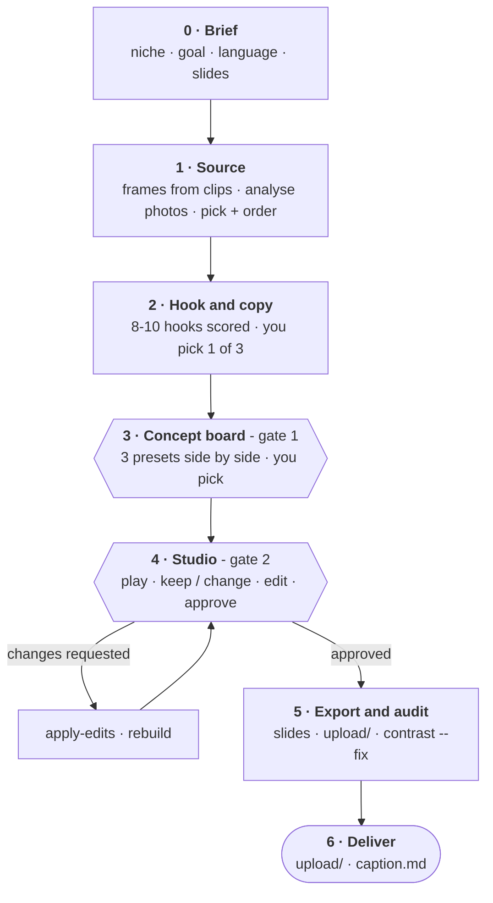

# The workflow

What the agent does at each step, what it asks you, and where you are in
control. The agent's own procedure is [SKILL.md](../skills/tiktok-photo-carousel/SKILL.md);
this is the same thing from your side of the screen.



## 0 · Brief

One round of questions, asked together: the **niche** (dreamcore, travel
guide, tips, POV...), the **goal** (saves, shares, comments, reach), the
**language**, and how many **slides**. If you have brand guidelines, the agent
reads them now - your rules override every default.

## 1 · Source

If you gave it video, it pulls the best stills first: sharp, well exposed,
not duplicates, spread across the clip, with phone HDR tone-mapped so frames
are not grey. Then it analyses every photo - palette, the subject's position,
how bright and busy each region is - and **looks at them itself** to pick and
order. Dim, cluttered and duplicate frames are dropped. The cover is chosen
for how hard it stops a thumb, not for how much it explains.

## 2 · Hook and copy

The hook is the copy on slide 1, and it decides whether anyone swipes. The
agent writes eight to ten across different mechanisms - contradiction, a
withheld noun, a real count, a POV - scores each, and offers you **the best
three**, each labelled with why it fits your cover photo.

Then the rest of the copy: one idea a slide, at most ~14 words (photo mode
moves on after 3-5 seconds), a payoff that answers the hook, one call to
action. **Nothing is invented** - no prices, rankings or claims you did not
give it. → [Hooks](../skills/tiktok-photo-carousel/references/hooks.md)

## 3 · Concept board - gate 1

Your browser opens a page with the same opening slides in **three presets**,
side by side. You pick one, or ask for a mix - one direction's type with
another's colour. Three rendered options settle a design conversation that
twenty questions would not.

## 4 · Studio - gate 2

The full deck, in your browser.

| Key | |
|---|---|
| **P** | **Play** - the deck in a phone frame with TikTok's interface, advancing on its own. Watch it first. |
| **E** | Edit any headline, sub line or label in place |
| **X** | Show what TikTok's interface covers, and the profile grid's crop |
| **C** | Draw TikTok's interface over every slide |
| **V** | Check the safe zones |

Under every slide: **Keep** or **Change**, and a note box. When you are done,
**Approve deck** downloads a small `edits.json`. Hand it back to the agent: it
merges your text edits and works through every slide you marked Change, then
the studio comes back for another look. If it is running with live reload,
the page updates itself as the agent edits, keeping your marks and notes.

Repeat until you approve with nothing marked Change.

## 5 · Export and audit

The agent exports the slides at exactly 1080x1920 and runs two checks:

- **Safe zones** - no copy under TikTok's interface.
- **Readability** - the contrast of every line, measured against the pixels
  actually behind it, plus minimum sizes. Where a line over a photo falls
  short it darkens that slide's photo slightly and checks again, until it is
  clean. If darkening would not help, it says why.

It also looks at the result itself - copy on a face, an awkward line break.

## 6 · Deliver

```text
upload/01.jpg ...   the slides, in posting order - 01 is the cover
cover.png           the cover
_cover_grid.png     the cover as your profile grid will crop it
caption.md          caption, hashtags, a pinned comment
```

Post them in order. The agent never posts for you.
