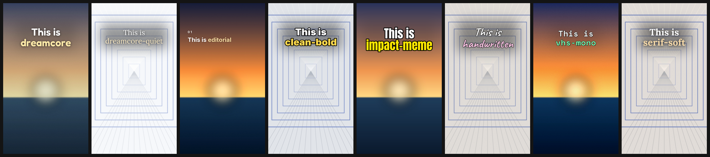

# Examples

Demo material for the README and for checking changes. **Every image here is
generated by code** and included under the repository's MIT license. Anyone can regenerate it; supplied reference screenshots and private photos are not bundled.

```text
examples/
  make_demo_photos.py    draws the three demo photos
  photos/                sunset.jpg  sea.jpg  hallway.jpg
  render.py              rebuilds every render below
  decks/
    analysis.json        analyze.py output for the demo photos
    templates-1.json     the original twelve templates
    templates-2.json     the newer ten, including the covers
    presets.json         one cover in each of the fifteen presets
    sunlit.json          three reference-led travel layouts
    together.json        quiet date-ideas / activity-list family
    harvest.json         brush titles and offset photo collages
    weekender.json       small mono captions and a two-photo diary stack
    dew.json             paired photos and positioned translucent labels
  renders/
    templates.png        all 37 templates      (README)
    presets.png          all 15 presets   (README hero)
    sunlit.png           Sunlit travel family  (README)
    together.png         Together family       (README)
    harvest.png          Harvest family        (README)
    weekender.png        Weekender family      (README)
    dew.png              Dew family            (README)
    templates-1/  templates-2/  presets/       the individual slides
  legacy/                the v1 Pillow renderer's scripts and output
```

## Regenerate

From the repo root:

```bash
npm run examples         # or: python examples/render.py
```

For each deck it builds the page, exports the slides, runs the readability
audit with `--fix` until it is clean, then composes the overview images.
Run it after any visual change and commit the renders with it, so the README
shows what the code actually does.

New demo photos: `python examples/make_demo_photos.py`.

## The decks

Open any deck to see the format in use - they are short. `presets.json` is a
**concept board** (`"board": true`), the same shape the agent builds at the
first gate: the same slide in every preset, each with its own `preset` field.

One warning in `templates-1` is expected: it is a catalogue, so slide 1 is
`full-bleed-hook` rather than a cover, and the audit notes that its headline
would not survive the profile grid's crop.

## Legacy

`legacy/` holds the v1 renderer's examples - text over a photo with Pillow,
fully offline:

```bash
python skills/tiktok-photo-carousel/scripts/carousel.py \
  --photos examples/photos --script examples/legacy/demo-script.json \
  --out out --style editorial
```


